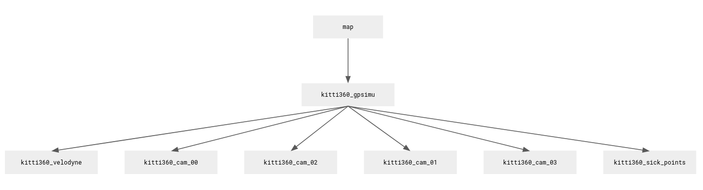

# ROS publisher node for the KITTI-360 Dataset

This ROS package takes each sensor from the
[KITTI-360](http://www.cvlibs.net/datasets/kitti-360/) dataset and publishes it
in ROS. The simulation can be paused, speed up, and one can step frame by frame.

If you have comments or questions please contact clemens.mosig@fu-berlin.de.

## Quick Start

**Installation:** Install python dependencies with `pip install -r
requirements.txt` and run `catkin_make` from the root of your catkin workspace.

**Launch Simulation:** To start the simulation you use `roslaunch` and specify the launch file
`launch/Kitti360.launch` as well as the directory where the KITTI-360 files are
located.

    roslaunch launch/Kitti360.launch directory:=/path/to/kitti/files/...

This will start the simulation and publish all available sensors in ROS. To
control the simulation, check out the keyboard mappings that are printed upon
start (and below).

**Mandatory KITTI-360 files**

For a given sequence at least the velodyne timestamps and the poses need to be
present. Everything else is optional. 

     KITTI-360
     |- data_3d_raw
        |- 2013_05_28_drive_{seq:0>4}_sync
            |- velodyne_points
                |- timestamps.txt
     |- data_poses
        |- 2013_05_28_drive_{seq:0>4}_sync
            |- poses.txt

## Usage Guide

**Required Directory Structure**

This package assumes that the sensor data is structured as specified in the
[KITTI-360](http://www.cvlibs.net/datasets/kitti-360/documentation.php) documentation.

**Keyboard Mappings**

    +--------------------------------------------------------------------+
    | key mapping for simulation control via terminal                    |
    |    *       : print this                                            |
    |    s       : step to next frame by VELODYNE (skips 3 SICK frames)  |
    |    d       : step to next frame by SICK                            |
    |    <space> : pause/unpause simulation                              |
    |    k       : increase playback speed factor by 0.1                 |
    |    j       : decrease playback speed factor by 0.1                 |
    |    [0-9]   : seek to x0% of simulation (e.g. 6 -> 60%)             |
    |    b       : print duration of each publishing step                |
    +--------------------------------------------------------------------+

**Basic Configuration**

The following parameters can be configure on launch:

| parameter name | default | description |
| --- | --- | --- |
| rate |       1 |         The playback speed as a factor |
| looping |    True |      Whether to loop back to the start at the end| 
| start |      0.0 |       Start N seconds into the simulation|
| end |        99999999 |  Stop N seconds into the simulation|
| sequence |   00 |        The KITTI-360 dataset sequence to play |
| directory |             | The path to the KIITI-360 directory |

**Timestamps**

Timestamps in the KITTI-360 dataset contain the actual time the data was
recorded in the real world.  For simplicity, the timestamps within the
simulation start at 0 for each sequence. The offsets are hardcoded into the
function `read_timestamps()`.

**Custom Message Types**

We use custom message types for semantics. These are specified in the `/msg`
folder.

**Performance**

The main bottleneck of simulation is reading the `*.png` files, which contain
the semantics, from the hard drive.
When enabling all sensors, the simulation will not be able to keep
up with real-time and skip frames, even with a fast NVMe M.2 SSD.

To figure out which publishing step takes the most time you can press `b`. This
will print an overview of how much time the data of each sensor takes to
publish as follows:

    [INFO] [...]: -------------------------------------------------------
    [INFO] [...]: sick points               = 0.002s (0.2%)
    [INFO] [...]: velodyne                  = 0.002s (0.2%)
    [INFO] [...]: image_00_data_rect        = 0.022s (1.7%)
    [INFO] [...]: image_01_data_rect        = 0.019s (1.5%)
    [INFO] [...]: image_00_data_rgb         = 0.023s (1.8%)
    [INFO] [...]: image_01_data_rgb         = 0.020s (1.5%)
    [INFO] [...]: image_02_data_rgb         = 0.661s (51.4%)
    [INFO] [...]: image_03_data_rgb         = 0.069s (5.3%)
    [INFO] [...]: bounding boxes            = 0.004s (0.3%)
    [INFO] [...]: 2d semanticID left        = 0.004s (0.3%)
    [INFO] [...]: 2d semantic rgb left      = 0.013s (1.0%)
    [INFO] [...]: 2d instanceID left        = 0.008s (0.7%)
    [INFO] [...]: 2d confidence left        = 0.018s (1.4%)
    [INFO] [...]: 3d semantics dynamic      = 0.003s (0.2%)
    [INFO] [...]: 3d semantics static       = 0.417s (32.5%)
    [INFO] [...]: total                     = 1.285s
    [INFO] [...]: -------------------------------------------------------

**Disabling Sensors**

All sensors are *enabled* by default.
Which sensor to disable can be specified when launching the simulation. For example:

    roslaunch launch/Kitti360.launch directory:=... pub_sick_points:=False

The precise name for each sensor are listed below:

| parameter name | description |
| --- | --- |
|`pub_velodyne`                     |velodyne pointcloud |
|`pub_sick_points`                  |sick points |
|`pub_perspective_rectified_left`   |images of left perspective camera |
|`pub_perspective_rectified_right`  |images of right perspective camera |
|`pub_perspective_unrectified_left` |images of left perspective camera (unrectified) |
|`pub_perspective_unrectified_right`|images of right perspective camera (unrectified) |
|`pub_fisheye_left`                 |images of left fisheye camera |
|`pub_fisheye_right`                |images of right fisheye camera |
|`pub_bounding_boxes`               |bounding boxes |
|`pub_2d_semantics_left`            |semantic ID of each pixel (left cam) |
|`pub_2d_semantics_right`           |semantic ID of each pixel (right cam) |
|`pub_2d_semantics_rgb_left`        |color-coded semantic label for each pixel (left cam) |
|`pub_2d_semantics_rgb_right`       |color-coded semantic label for each pixel (right cam) |
|`pub_2d_instance_left`             |instance label of each pixel (left cam)
|`pub_2d_instance_right`            |instance label of each pixel (right cam) |
|`pub_2d_confidence_left`           |confidence map (left cam) |
|`pub_2d_confidence_right`          |confidence map (right cam) |
|`pub_3d_semantics_static`          |static 3d semantics |
|`pub_3d_semantics_dynamic`         |dynamic 3d semantics |

If the required files are not present for an enabled sensor it will disable
itself automatically and print an error message in the logs. The simulation
will simply continue without the sensor.

**Transformation Tree**

**Python requirements**

Python >=3.8 and package dependencies are listed in `requirements.txt`.

## Contribution

As of now, this package has barely been used and is not sufficiently tested. If
you encounter any issues please open a GitHub issue or contact me via email
clemens.mosig@fu-berlin.de. Also, please do not hesitate to send pull
requests!

## Notes / Todos

If you have comments on this or would like to contribute please send me an
email (clemens.mosig@fu-berlin.de) or open a pull request.

* **OXTS measurements**: We are not yet publishing these.
* **Camera Intrinsics**: We are not sure 100% sure whether the camera intrinsics are published correctly (see NOTEs in code).
* **Static Transforms**: These are published from the launch file (`Kitti360.launch`). We computed the parameters by hand from the sketch on the KITTI360 website. There may be errors.
* **3D Semantics and Bounding Boxes**: The ranges specified in the filenames overlap in most cases (~15 frames). If we have the choice between two ranges we publish the one with the highest range, i.e., prefer 90-150 over 50-100 when the current frame is 95.
* **Bounding Boxes**: static and dynamic bounding boxes are handled the same way at the moment. This may need to be changed. The custom bounding box message contains a bool that represents whether it is dynamic or static.
* **3D Semantics**: 3d semantics are accumulated to a range of frames in KITTI360. If there is no pointcloud for a given frame range then we publish nothing.
